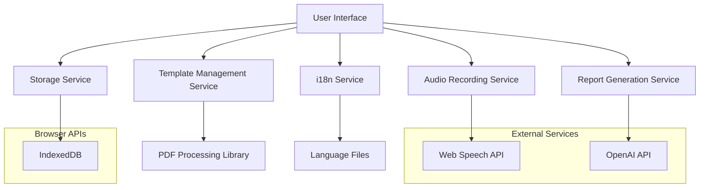

# I've Used Amazon Kiro for One Week
My vision about the AI-code editor of the moment.

Last week the AI Code editor world trembled with a new announcement from Amazon. They launched Kiro, a new AI-powered code editor based on VS Code, but with a different proposal if compared to other AI Code editors.

## The vibe coding problem

If you followed the development of code editors like Cursor and Windsurf, you probably heard the popular "vide coding" term being used here and there. I've been vide coding for a while, and it's fun at certain stages. But there are many struggles.

The main struggle for me is that it's easy to lose track of the direction you're going. You start a project, and as your head fill with ideas, you end in a loop whole of fixing code, breaking it, fixing it again, and nothing comes out.

This can be sorted with documentation, but this is also a struggle. Vibe coding makes it hard to update documentation simply because your flowing on the vibes. So chances are that you'll produce a lot of code and forget about documentation.

And finally, the quality of the code is questionable at best. And let's be frank: nobody sees the code produced while vibe coding before making a commit. Everything is much more oriented at testing and making sure it works.

## Kiro tries solves the vibe coding problem

When you open the AI chat on Kiro you are asked to choose the mode. Vibe or Spec.

Vibe is exactly as you expect. It's going to produce code as your stuff to it.

Spec is a bit more complex, and in my opinion, it's a step in the right direction. The Spec mode will produce three documents: requirements, design and tasks. All of these as Markdown files inside the `.kiro` directory. Kiro's UI is already made on purpose to display these three files as a core feature of the editor.

[image 1.webp]

## Requirements

When you describe your need on the chat, it will generate a requirements file first. These requirements follow a structure:

```markdown
### Requirement 1

**User Story:** As a healthcare professional, I want the application to support both English and Brazilian Portuguese, so that I can use it in my preferred language.

#### Acceptance Criteria

1. WHEN the user first opens the application THEN the system SHALL detect the browser language and set it as default
2. WHEN the user selects a language option THEN the system SHALL update all interface elements to the selected language
3. WHEN the user dictates in Portuguese THEN the system SHALL transcribe and process the content in Portuguese
4. WHEN the user dictates in English THEN the system SHALL transcribe and process the content in English
5. WHEN generating reports THEN the AI SHALL maintain the same language as the input transcription
```

It will generate as many requirements as necessary to fulfill your idea. You can add more prompts to refine or add more requirements.

Once you're happy, you move to the design phase.

## Design

Design is a bad term for that this step is. I think "architecture" would more appropriate. But it's the system design.

I will generate a document with the whole architecture of your application, including some Mermaid diagrams, type interfaces, service interfaces, and etc. It will also give specifics about what technologies to be used.

Below is an example Mermaid diagram:



Again, you can add prompts to refine the architecture document with specific technologies or changes in interfaces or types.

Depending on how deep the change you want, Kiro will figure out that the new change needs a new requirement, or a change in an existing requirement. This showcases how deeply tied together the phases are.

Once you're happy, you move to the tasks phase.

## Tasks

The tasks are a list of concrete steps to be taken to implement the architecture based on the specs.

They are formatted as markdown lists, and Kiro adds shortcuts on top of each task to execute them, or re-execute them if needed. This allows you to run each task individually to make sure they are verified and working as expected.

Each task run is pure implementation. You can commit each iteration one by one.

## Considerations

Do I like it? Yes.
Will I use it? No.

Because it's too complex, and in my perspective, Amazon is late to the party. Of course, Kiro does something that no other AI tools for coding does. Generating specification with BDD, architecture and tasks is certainly very cool. I really pay my respects.

But Anthropic is leading the movement to turn developers in AI powered developers. And I love how they are doing it. Claude Code does is an amazing tool. The plan mode, the skills, and the MCPs are capable of accomplishing any sort of task, without slop or bias. A nice set of tools integrated on Claude Code makes all difference.

It's important to mention that AI is only great for coding if you are great in coding. AI won't do your job. It will make you faster. You still have to have the responsibility of knowing what you are doing.

That's my advice for AI powered developers today.
